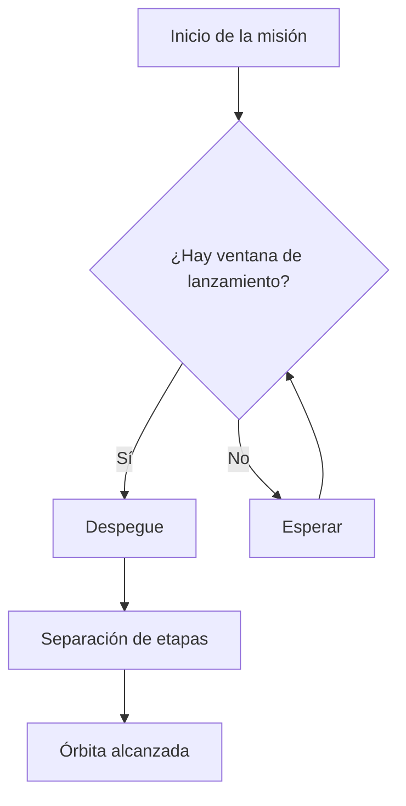
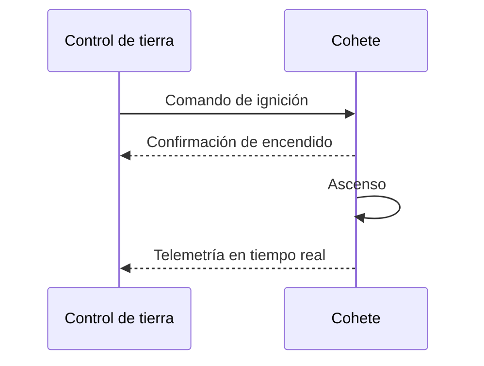
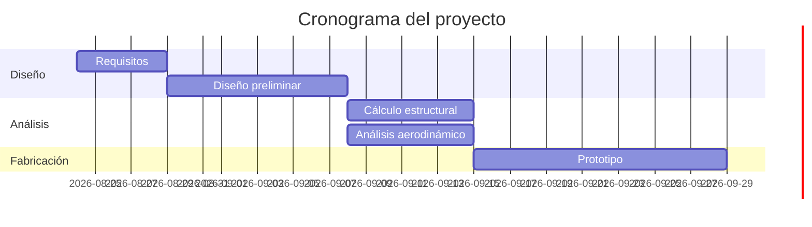
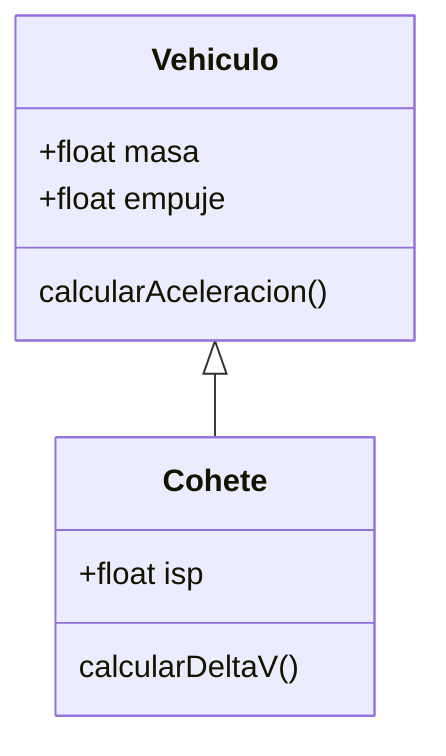

# 05 · Diagramas con Mermaid

Mermaid permite dibujar diagramas escribiendo texto plano dentro de un bloque
de código con la etiqueta `mermaid`. Funciona nativo en GitHub y Obsidian; en
VSCode requiere la extensión **Markdown Preview Mermaid Support**.

## Diagrama de flujo

````markdown

````


## Diagrama de secuencia



## Diagrama de Gantt (planificación de un proyecto)



## Diagrama de clases (útil para modelar sistemas)


