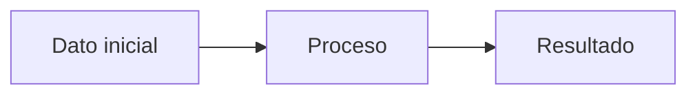

# [Tema del apunte]

> **Curso:** [nombre] · **Fecha:** [YYYY-MM-DD] · **Fuente:** [libro/clase]

## Resumen

Breve resumen del tema en 2-3 líneas.

## Conceptos clave

| Término | Definición |
|---|---|
| ... | ... |

## Desarrollo

### Sub-tema 1

Explicación...

$$
\text{ecuación clave}
$$

**Idea importante:** resáltalo así.

### Sub-tema 2

- Punto 1
- Punto 2
  - Detalle

## Ejemplo resuelto

<details>
<summary>Ver enunciado</summary>

Enunciado del problema aquí.

</details>

<details>
<summary>Ver solución</summary>

```markdown
Paso 1: ...
Paso 2: ...
```

$$
\text{resultado final}
$$

</details>

## Diagrama / esquema



## Dudas / pendientes

- [ ] Pregunta para el profesor
- [ ] Repasar antes del examen

## Referencias

[^1]: Referencia bibliográfica o fuente.
